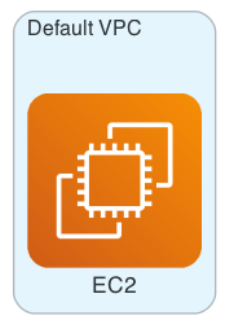
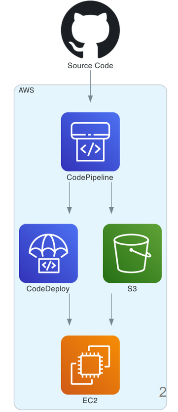
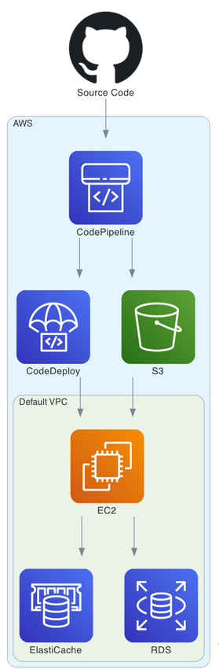
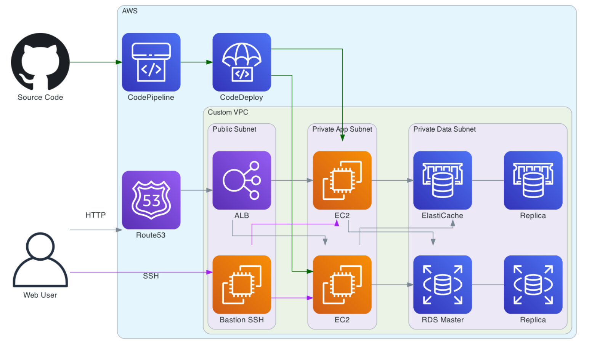
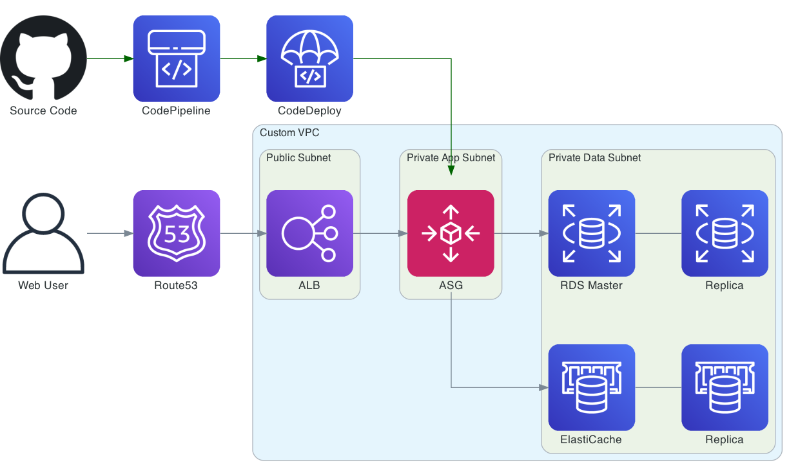
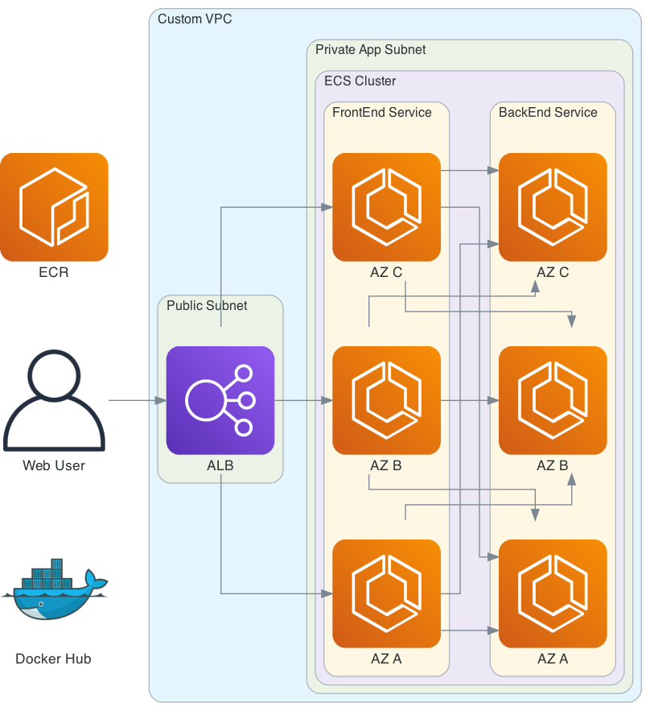
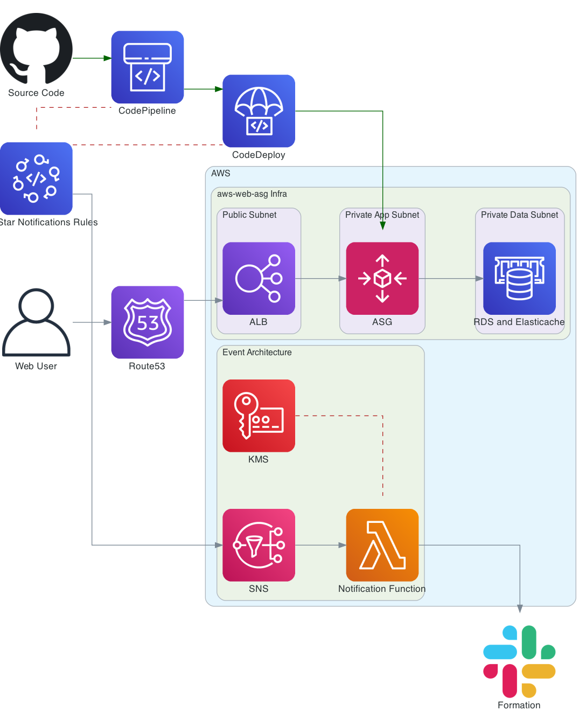
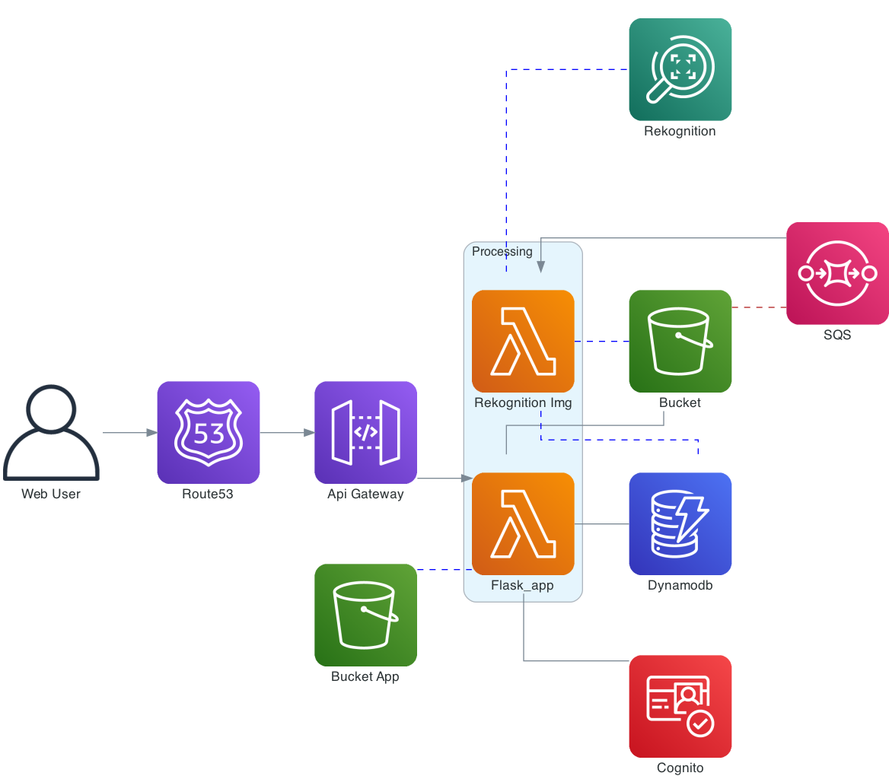
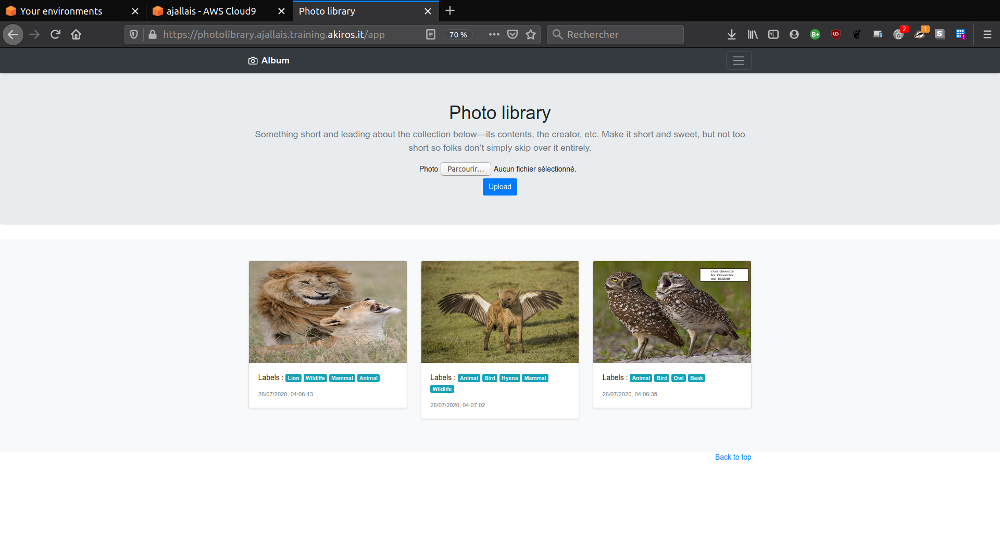

# AWS-terraform

Content of pratical lessons introducing AWS cloud computing deployed with Terraform.
Works realized in the AWS formation kindly offered by AkirosIT, CloudInit and Mangrove 
([link to the certification](https://acloud.zaclys.com/index.php/s/GFgDXiSkg3jpxCx)).

## Table of contents

+ Infrastructure as Code
+ AWS Fundamentals
+ Deployment and continuous integration
+ 3-tier Web Architecture
+ Resilient and Secure Architecture
+ Elastic Architecture
+ Containers and microservices architecture
+ Event-Driven Architecture
+ Serverless Architecture

## Contents

### Infrastructure as Code

Introduction to , infrastructure as a code.

### AWS Fundamentals

Creation of a minimalist architecture to deploy a blog in the Stockholm region. The architecture will be as the following :

### Deployment and continuous integration

Deployment of a web architecture to run a WordPress blog, of which the deployment of the new code will be automated. The architecture will be as the following :

### 3-tier Web Architecture

Creation of a web architecture to deploy a WordPress blog composed of an EC2 instance to run our web server, an RDS instance for database, an ElastiCache node for temporary storage. The architecture will be as the following :

### Resilient and Secure Architecture

In this tutorial a highly available and secure web architecture will be created.

The network brick will be composed of :

- a VPC and an Internet Gateway
- a group of public subnets distributed over 2 availability zones:
- the resources that will be deployed there will be publicly accessible.
- a group of Private App subnets distributed over 2 availability zones:
- The resources deployed in this group will not be publicly accessible.
- This group will be reserved for resources of the "Application" layer.
- a group of Private Data subnets on 2 availability zones.
- the resources that will be deployed there will not be publicly accessible.
- This group will be reserved for "Data" layer resources.
- - a NAT Gateway that will allow the resources in the private networks to communicate outside the VPC.

The architecture will be composed of the following resources:

- a Load Balancer in the Public subnet group.
- An EC2 instance in each subnet of the Private App group to run our web server.
- a multi-zone RDS instance in the Private Data subnet group for the database.
- one ElastiCache node in each subnet of the Private Data group for the cache.

The application will be managed and deployed by CodePipeline and CodeDeploy.

### Elastic Architecture

In this lab, a highly available, secure and elastic web architecture will be created. It will be composed of the following resources:

- a load balancer (LoadBalancer) in the Public subnet group.
- an autoscaling group that will launch EC2 instances in the Private App subnet group to run our web server.
- a multi-zone RDS instance in the Private Data subnet group for the database.
- one ElastiCache node in each subnet of the Private Data group for the cache.

The application will be managed and deployed by CodePipeline and CodeDeploy.

### Containers and microservices architecture

In this tutorial, a micro-services architecture will be created, it will be composed of :

- a Load Balancer
- an ECS cluster
- 2 applications (Frontend and Backend)

### Event-Driven Architecture

In this tutorial, we will add to our `aws-web-asg` architecture a notification system with our chat tool (slack). This will allow us to be notified quickly when an automated action is executed.

This integration requires :

- Deploy AWS Sns (Simple Notification Service)
- Deploy a Lamba function to format and send our notifications
- Deploy AWS KMS services to encrypt and secure sensitive information

### Serverless Architecture

In this lab, an architecture for a photo application with automatic analysis will be created.

This architecture will use only AWS hosted services without servers (100% serverless).

The architecture of our application will be composed of the following resources:

- `Lambda` instances to run the application code
- A `Rekognition` image analysis service
- A queuing service `SQS`.
- A `DynamoDB` database service
- A `Cognito` authentication service

See below, an example of usage :

